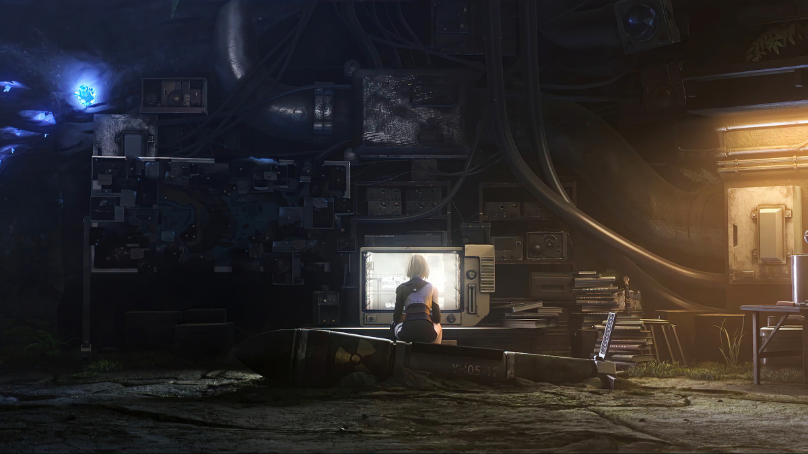

<h1 align="center">Hi 👋🏿, I'm WillMA</h1>
<h3 align="center">DevOps Engineer</h3>

<!--
**WillMAZHIYUAN/WillMAZHIYUAN** is a ✨ _special_ ✨ repository because its `README.md` (this file) appears on your GitHub profile.
-->

once it flies, will soar high into the sky; once it cries, it will startle the world with a single cry. again, once it flies, will soar high into the sky; once it cries, it will startle the world with a single cry.

#### 🎵 Things I am currently working on:

- Research monitoring system.
- Configure the vim editor.
- Develop plug-ins for O&M tools on [exporter](https://willma.cloud).

#### 🏀 Things I am challenging myself with:

- One hour of piano practice per day
- Play basketball one hour a day
- Coding at least 4 hours a day
- Write three blogs per week

#### 💻 Programming languages and tools:

 

<code></code>
<code></code>
<code></code>
<code></code>
<code></code>
<code></code>
 
<code></code>
<code></code>
<code></code>
<code></code>
<code></code>
<code></code>

 

---
<!-- Its main projects -->

  
  
  

